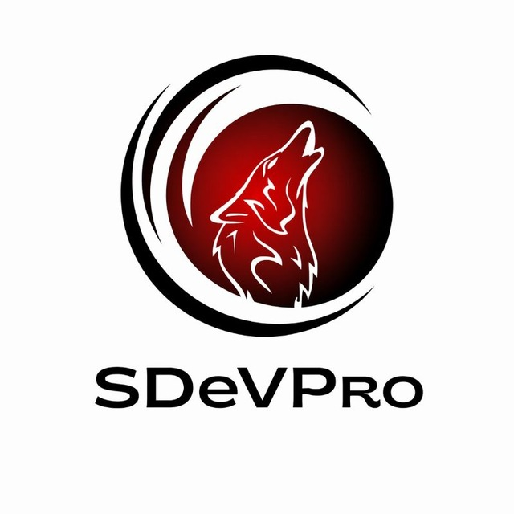

<p align="center">
  
</p>

<div align="center">

# SDeVPro

### AI yordamida avtonom xavfsizlik tekshiruvi va monitoring platformasi

</div>

---

## Loyiha haqida

**SDeVPro** — to'liq mahalliy (on-premise) ishlaydigan, AI-asoslangan
xavfsizlik tekshiruvi va monitoring platformasi. Litsenziya va kelib chiqish
tarixi haqida to'liq ma'lumot [NOTICE](NOTICE) faylida keltirilgan. Asosiy
xususiyatlari:

- **Docker talab qilinmaydi.** Asosiy mahsulot — `sdevpro/` paketidagi
  skanerlash motori — to'g'ridan-to'g'ri Python orqali, hech qanday
  konteyner yoki tashqi sandbox'siz ishlaydi.
- **Hech qanday tashqi xizmatga ulanmaydi.** SDeVPro faqat (a) siz kiritgan
  AI provayder (OpenAI/Anthropic/Gemini va h.k.) bilan to'g'ridan-to'g'ri, va
  (b) tekshirilayotgan nishonning o'zi bilan aloqa qiladi. Hech qanday
  telemetriya, analitika yoki uchinchi tomon "xavfsizlik platformasi"ga
  ma'lumot yuborilmaydi.
- **Har bir foydalanuvchi o'z AI tokeni bilan ishlaydi.** `/setkey` orqali
  kiritilgan token shifrlangan holda saqlanadi va faqat o'sha
  foydalanuvchining so'rovlari uchun ishlatiladi — boshqa hech kim (hatto bot
  operatori ham) uni ko'ra olmaydi.
- **3 tilda interfeys:** o'zbek, rus, ingliz — `/language` orqali tanlanadi;
  AI tomonidan yoziladigan xulosa, tuzatish yo'riqnomasi va himoya
  tavsiyalari ham tanlangan tilda chiqadi.
- **Telegram bot orqali ishlaydi.** Mijoz o'z tizimini (sayt, API, server,
  yoki GitHub repository) botga yuboradi — bot to'liq tekshiruv o'tkazadi, AI
  yordamida xulosa va tuzatish yo'riqnomasi beradi, va xohlasa belgilangan
  vaqt oralig'ida (masalan har soatda) avtomatik qayta tekshirib, hisobot
  yuborib turadi.
- **Har bir hisobot uchta shaklda:** Telegram xabarlari (real vaqtda) + PDF
  hujjat + TXT (to'liq matn) hujjat — barchasi yuklab olinadi.
- **Server-log tahlili.** Mijoz o'z server logini (.log/.txt) yuborsa, bot
  undan shubhali IP manzillar va hujum urinishlarini (SQLi, XSS,
  brute-force va h.k.) ajratib, yuklab olinadigan hisobot beradi.
- **GitHub repository skaneri.** Ochiq yoki (token bilan) yopiq repolarni
  klonlab, kod ichidagi maxfiy kalitlar va xavfli naqshlarni tekshiradi.

Kod bazasi ichki texnik sabablarga ko'ra ikkita Python paketidan iborat:
`sdevpro/` (asosiy, Docker'siz, yangi dvigatel) va `sdevpro/` (ichki modul
nomi — asl ko'p-agentli, Docker-sandbox asosidagi chuqur tekshiruv mexanizmi;
foydalanuvchiga ko'rinmaydi, hech qanday tashqi xizmatga ulanmaydi va
standart ishga tushirishda ishlatilmaydi). Ikkalasi ham to'liq mustaqil —
`sdevpro/`.

> [!WARNING]
> **Faqat vakolat berilgan tekshiruvlar uchun.** SDeVPro sizga ko'rsatgan
> nishonlarni real ravishda tekshiradi/hujum qiladi. Faqat o'zingizga
> tegishli yoki tekshirish uchun yozma ruxsatga ega bo'lgan tizimlarni
> tekshiring. Ruxsatsiz tekshiruv ko'p mamlakatlarda jinoiy javobgarlikka
> sabab bo'ladi. Botning har bir mijozi tekshiruvdan oldin buni tasdiqlashi
> shart (`/scan` buyrug'i shu tasdiqni so'raydi).

---

## Tez boshlash — lokal/VPS server (tavsiya etiladi, Docker'siz)

Bu yo'l botning barcha imkoniyatlarini (jumladan davriy `/schedule`
tekshiruvlarini) to'liq qo'llab-quvvatlaydi va jonli sinovdan o'tkazilgan.

### 1. Talablar

- Python 3.12+ (loyiha `.venv/` da Python 3.14 bilan sinovdan o'tkazilgan)
- Telegram bot tokeni ([@BotFather](https://t.me/BotFather) orqali oling: `/newbot`)
- Git (GitHub repository skaneri uchun — ixtiyoriy)

> AI (LLM) tokenini operator emas, **botdan foydalanadigan har bir
> foydalanuvchi o'zi** `/setkey` buyrug'i orqali kiritadi — pastdagi
> "Telegram botidan foydalanish" bo'limiga qarang.

### 2. O'rnatish

PowerShell'da loyiha papkasida (eng oson yo'l — tayyor skript):

```powershell
.\scripts\setup_windows.ps1
```

Yoki qo'lda:

```powershell
python -m venv .venv
.\.venv\Scripts\Activate.ps1
pip install litellm requests reportlab cryptography python-dotenv dnspython beautifulsoup4 "python-telegram-bot[job-queue]"
pip install -e . --no-deps
```

### 3. Sozlash

```powershell
copy .env.example .env
notepad .env
```

`.env` faylida kamida quyidagini to'ldiring:

```
TELEGRAM_BOT_TOKEN=123456:ABC-...
```

Birinchi marta ishga tushirishda **tavsiya etiladi**: `SDEVPRO_ALLOWED_USERS`
ni to'ldirish, agar botni faqat o'zingizga (yoki ma'lum mijozlarga) ochiq
qilmoqchi bo'lsangiz. Bo'sh qoldirilsa, botga yozgan har bir kishi (faqat
o'zining AI tokeni bilan) foydalana oladi. ID'ni bilish uchun Telegram'da
[@userinfobot](https://t.me/userinfobot) ga yozing.

### 4. Ishga tushirish

```powershell
sdevpro-bot
```

yoki: `python -m sdevpro.main`

Botni doimiy (kompyuter qayta yoqilganda ham) ishlashi uchun Windows Task
Scheduler'da "At startup" trigger bilan shu buyruqni ishga tushiruvchi vazifa
yarating (`scripts/run_bot.ps1` shablonini ishlating), yoki `nssm`/`pm2`
kabi vosita bilan Windows xizmati sifatida o'rnating.

---

## Telegram botidan foydalanish

### Birinchi qadamlar

1. Botga `/start` yuboring — til tanlash tugmalari chiqadi (O'zbekcha /
   Русский / English).
2. `/setkey <provider>/<model> <token>` — o'z AI tokeningizni kiriting.
   Qayerdan olish mumkinligi: `/aitoken` (barcha asosiy provayderlar uchun
   havolalar bilan, tanlangan tilda).
3. `/scan <manzil>` — birinchi tekshiruv (vakolat tasdiqlash so'raladi).

### To'liq buyruqlar ro'yxati

| Buyruq | Tavsif |
|---|---|
| `/start` | Xush kelibsiz + til tanlash |
| `/help` | To'liq qo'llanma (tanlangan tilda) |
| `/language` | Interfeys tilini o'zgartirish |
| `/setkey <provider/model> <token>` | O'z AI tokeningizni kiritish (shifrlangan saqlanadi) |
| `/aitoken` | AI token qayerdan olinishi bo'yicha yo'riqnoma |
| `/deletekey` | Saqlangan AI tokenni o'chirish |
| `/mysettings` | Joriy sozlamalar (til, model, GitHub token holati) |
| `/setgithubtoken <token>` | Yopiq GitHub repolarni tekshirish uchun token |
| `/githubtoken` | GitHub token qayerdan olinishi bo'yicha yo'riqnoma |
| `/scan <manzil>` | Bir martalik to'liq tekshiruv — sayt, API yoki `github.com/...` repo |
| `/schedule <manzil> <interval>` | Davriy tekshiruv, masalan `/schedule https://example.com 1h` |
| `/unschedule <manzil>` | Davriy tekshiruvni bekor qilish |
| `/myschedules` | Faol davriy tekshiruvlar ro'yxati |
| `/report` | Oxirgi hisobotni qayta olish (matn + PDF + TXT) |
| *.log / .txt fayl yuborish* | Server log fayli asosida hujum-manba tahlili |

Har bir tekshiruv quyidagilarni o'z ichiga oladi:

1. **Recon** — DNS, ochiq portlar, HTTP sarlavhalar, TLS sertifikat holati,
   texnologiya (CMS/freymvork) aniqlash. (GitHub manzil berilsa — repository
   avtomatik klonlanadi.)
2. **Web probelar** — xavfsizlik sarlavhalari, cookie flaglar, CORS
   konfiguratsiyasi, clickjacking, ochiq redirect, reflected XSS, SQL
   Injection (xato-asoslangan), oshkor bo'lib qolgan maxfiy fayllar
   (`.git`, `.env`, backup fayllar va h.k.).
3. **Kod skaneri** (mahalliy papka yoki GitHub repo — whitebox rejim) —
   maxfiy kalitlar (AWS/GitHub/Slack tokenlari), xavfli kod naqshlari
   (`eval`, `os.system`, xom SQL-concatenation va h.k.).
4. **AI tahlili** (sizning tokeningiz bilan) — barcha topilmalarni
   ustuvorlik bo'yicha saralaydi, har biriga CVSS baho, hujum stsenariysi va
   aniq tuzatish yo'riqnomasi yozadi, umumiy holat xulosasi va tizim
   darajasidagi himoya tavsiyalarini tanlangan tilda beradi.
5. **Hisobot** — Telegram xabarlari (real vaqtda) + to'liq PDF fayl + to'liq
   TXT fayl.

AI hech qachon dalilsiz yangi "topilma" o'ylab topmaydi — u faqat real
probelar aniqlagan holatlarni tushuntiradi va ustuvorlashtiradi.

---

## Onlayn joylashtirish — Vercel (ixtiyoriy, cheklovlar bilan)

Loyihada `api/index.py` + `vercel.json` + `requirements.txt` orqali Vercel
uchun webhook-asoslangan versiya ham tayyorlangan. **Muhim: bu yo'l lokal
polling-bot bilan solishtirganda cheklovlarga ega — quyidagini albatta
o'qing.**

### Nima uchun farq bor

Vercel funksiyalari **serverless** — har so'rovdan keyin jarayon to'xtaydi,
doimiy fon jarayoni (polling, ichki scheduler) ishlay olmaydi. Shu sabab:

- **Saqlash:** lokal fayl tizimi so'rovlar orasida saqlanmaydi. Shuning
  uchun `SDEVPRO_STORAGE_BACKEND=redis` + bepul
  [Upstash Redis](https://upstash.com) hisobingiz shart (`.env.example`da
  ko'rsatilgan `UPSTASH_REDIS_REST_URL`/`UPSTASH_REDIS_REST_TOKEN`).
- **Ijro vaqti:** to'liq tekshiruv (recon + probelar + AI) 30–120+ soniya
  davom etishi mumkin — bu Vercel Hobby rejasining standart limitidan
  uzoqroq. `vercel.json`da `maxDuration: 60` o'rnatilgan (Pro rejasida
  yuqoriroq qiymatlar mumkin). Hobby rejada faqat tezkor (`quick`) va kichik
  nishonlar ishonchli ishlaydi.
- **Jadval (`/schedule`):** doimiy JobQueue yo'q — buning o'rniga
  `vercel.json`dagi Vercel Cron `/api/cron`ni chaqiradi, u esa muddati kelgan
  jadvallarni ishga tushiradi. **Hobby rejada Vercel Cron faqat kuniga bir
  marta** ishlaydi (haqiqiy "har soatda" emas); Pro rejada daqiqama-daqiqa
  cron mumkin. Haqiqiy soatlik avtomatika uchun eng ishonchli yo'l — hozirgi
  bo'limda tasvirlangan doimiy lokal/VPS bot.

**Xulosa:** Vercel — tezkor on-demand tekshiruvlar va kichik demo/frontend
uchun yaxshi; doimiy avtomatik monitoring (har soatlik hisobotlar) uchun
lokal/VPS'dagi doimiy botni asosiy deb hisoblang, Vercel'ni qo'shimcha
kirish nuqtasi sifatida ishlating.

### Joylashtirish qadamlari

1. [Upstash](https://upstash.com)da bepul Redis database yarating, REST URL
   va Token'ni oling.
2. Vercel loyihasini yarating (GitHub repo'ingizni ulang yoki `vercel` CLI
   bilan joylashtiring).
3. Vercel loyiha sozlamalarida (Environment Variables) quyidagilarni
   qo'shing:
   ```
   TELEGRAM_BOT_TOKEN=...
   SDEVPRO_STORAGE_BACKEND=redis
   UPSTASH_REDIS_REST_URL=...
   UPSTASH_REDIS_REST_TOKEN=...
   SDEVPRO_SECRET_KEY=...   # openssl rand -base64 32 bilan generatsiya qiling
   SDEVPRO_WEBHOOK_SECRET=...   # ixtiyoriy, lekin tavsiya etiladi
   SDEVPRO_CRON_SECRET=...      # ixtiyoriy
   ```
4. Deploy tugagach, Telegram webhook'ni o'rnating (o'z tokeningiz va Vercel
   domeningiz bilan almashtiring):
   ```bash
   curl "https://api.telegram.org/bot<TOKEN>/setWebhook?url=https://<sizning-loyihangiz>.vercel.app/api/webhook&secret_token=<SDEVPRO_WEBHOOK_SECRET>"
   ```
5. Tekshirish: `https://<loyiha>.vercel.app/api/health` — `{"ok": true, ...}`
   qaytarishi kerak.

Bu qism mahalliy muhitda deploy qilinmagani sababli jonli sinovdan
o'tkazilmadi (faqat Flask test-client bilan sintetik so'rov orqali
tekshirildi) — joylashtirgach xatolik chiqsa, log'larni yuborsangiz birga
tuzataman.

---

## GitHub'ga push qilish — `SamirGroup/SDeVPro`

Loyiha allaqachon `git init` qilingan va `origin` remote
`https://github.com/SamirGroup/SDeVPro.git` ga sozlangan. Yangilangan
holatni push qilish uchun:

```powershell
cd D:\production\KodTekshir\SDeVProAI\SDeVPro
git add -A
git commit -m "SDeVPro: ko'p tillilik, shaxsiy AI token, GitHub skaner, Vercel adapter"
git push origin main
```

Agar repository hali GitHub'da yaratilmagan bo'lsa: github.com/SamirGroup
tashkilotida "New repository" -> nomi `SDeVPro` -> Public/Private tanlang ->
"Create repository" (README/`.gitignore` qo'shmang, chunki ular allaqachon
mavjud).

**Diqqat — `.env` faylini hech qachon push qilmang** (u `.gitignore`da
istisno qilingan, lekin tekshirib ko'ring: `git status` chiqarishida `.env`
ko'rinmasligi kerak). Agar tasodifan commit qilib qo'ygan bo'lsangiz,
Telegram tokenini @BotFather orqali darhol bekor qiling (`/revoke`) va
yangisini oling.

---

## Loyiha tuzilishi

```
SDeVPro/
├── sdevpro/              # Asosiy, Docker'siz mahsulot
│   ├── scanner/          # recon, web probe, kod skaneri, GitHub klonlash
│   ├── ai_analyst.py     # LLM-asoslangan triage/hisobot generatsiyasi (ko'p tilli)
│   ├── reporter.py       # Telegram matn + PDF + TXT hisobot (ko'p tilli)
│   ├── log_analyzer.py   # Server-log hujum-manba tahlili (ko'p tilli)
│   ├── telegram_bot.py   # Bot buyruqlari, til, token, jadval, consent
│   ├── i18n.py            # uz/ru/en tarjimalar
│   ├── crypto_utils.py    # Foydalanuvchi tokenlarini shifrlash
│   ├── kvstore.py         # Saqlash backend abstraksiyasi (file / Upstash Redis)
│   ├── storage.py         # Schedule/tarix/consent/foydalanuvchi sozlamalari
│   ├── github_scan.py     # GitHub/GitLab repo klonlash
│   ├── webhook_app.py     # Vercel/serverless uchun Flask webhook adapteri
│   └── config.py          # .env orqali sozlash
├── api/index.py          # Vercel kirish nuqtasi
├── vercel.json            # Vercel marshrutlash + cron sozlamalari
├── requirements.txt        # Vercel uchun minimal bog'liqliklar
├── sdevpro/                 # Ichki modul nomi — asl ko'p-agentli dvigatel
│                          # (Docker-asoslangan, standart oqimda ishlatilmaydi)
├── .env.example
└── NOTICE                 # Apache-2.0 talabiga ko'ra o'zgarishlar ro'yxati
```

## Litsenziya

Apache License 2.0 — [LICENSE](LICENSE) faylini ko'ring. Ushbu loyiha
hosila (derivative) ish — [NOTICE](NOTICE) faylida original mualliflik
huquqi va barcha o'zgarishlar ro'yxati saqlangan.
