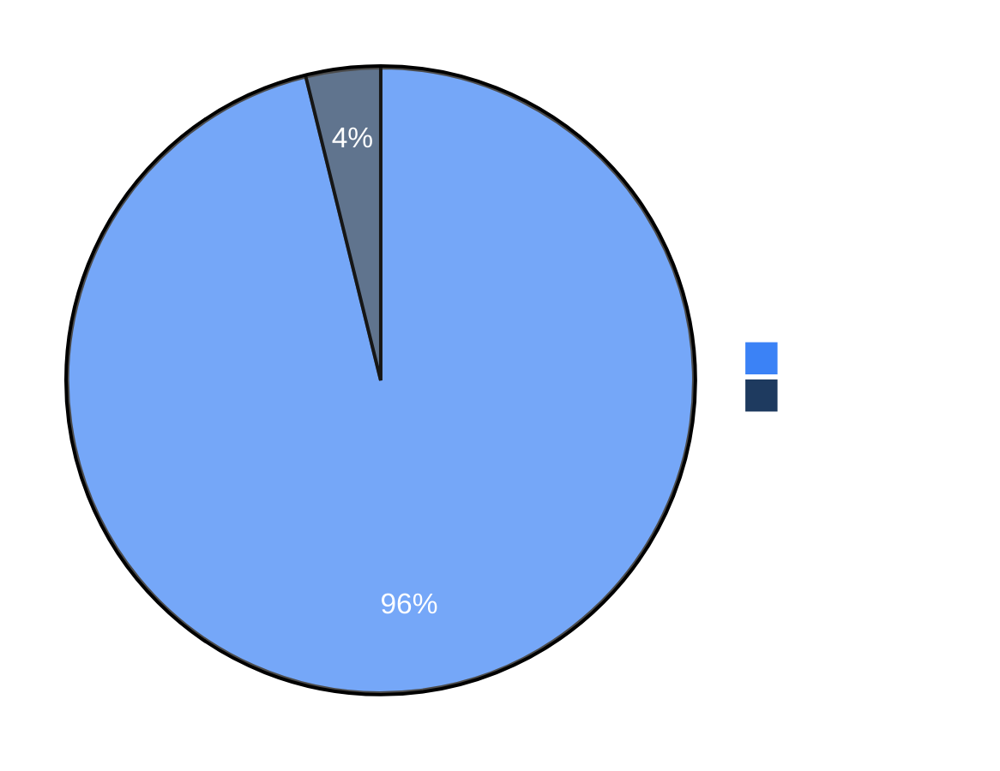

# Benchmarks

SDeVPro's underlying scan engine (`sdevpro/engine`) is a derivative of the
open-source Strix pentesting agent. The results below are the **upstream**
project's published benchmark results (inherited, not independently
re-run by SDeVPro) and are kept here for reference on the engine's
capabilities. See [NOTICE](../NOTICE) for the full list of changes SDeVPro
made on top of that upstream engine.

## Full Details

For the complete upstream benchmark results, evaluation scripts, and run
data, see the original [usestrix/benchmarks](https://github.com/usestrix/benchmarks)
repository.

## Results (upstream, `v0.4.0`)

| Benchmark | Challenges | Success Rate |
|-----------|------------|--------------|
| [XBEN](https://github.com/usestrix/benchmarks/tree/main/XBEN) | 104 | **96%** |

### XBEN

The [XBOW benchmark](https://github.com/usestrix/benchmarks/tree/main/XBEN) is a set of 104 web security challenges designed to evaluate autonomous penetration testing agents. Each challenge follows a CTF format where the agent must discover and exploit vulnerabilities to extract a hidden flag.

The upstream engine (`v0.4.0`) achieved a **96% success rate** (100/104 challenges) in black-box mode.

**Performance by Difficulty:**

| Difficulty | Solved | Success Rate |
|------------|--------|--------------|
| Level 1 (Easy) | 45/45 | 100% |
| Level 2 (Medium) | 49/51 | 96% |
| Level 3 (Hard) | 6/8 | 75% |

**Resource Usage:**
- Average solve time: ~19 minutes
- Total cost: ~$337 for 100 challenges
